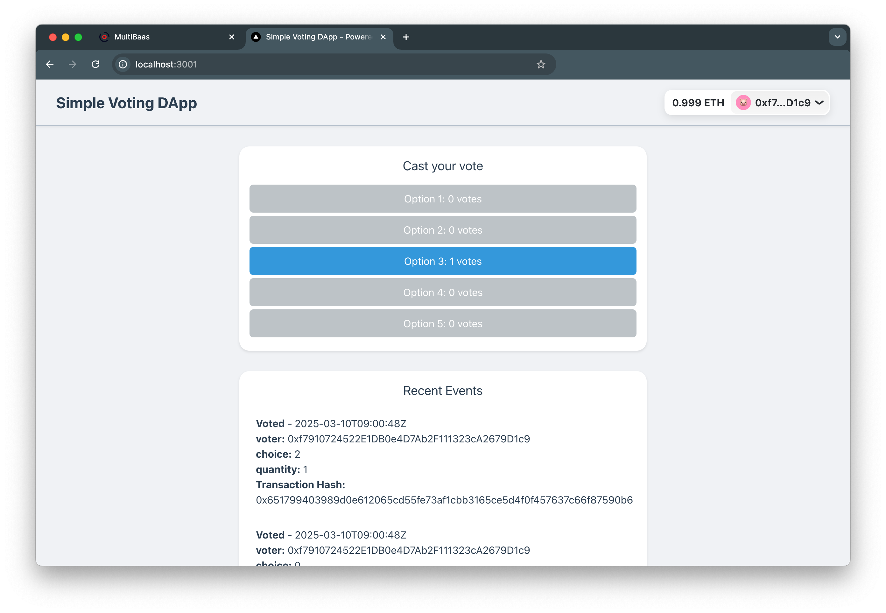

# MultiBaas Sample App

The purpose of this project is to demonstrate how to build a frontend-only decentralized application that uses [MultiBaas](https://docs.curvegrid.com/multibaas/) to handle the complexities of interacting with an EVM smart contract.



## Quickstart Guide

You will need a few things to get started. Do this _before_ running npm install.

1. Go to [console.curvegrid.com](https://console.curvegrid.com), sign up, and create a MultiBaas deployment on your network of choice (use "Curvegrid Testnet" if unsure).
2. Go to Admin > API Keys > New Key and create a key with label "sample_app_admin" and select "Administrators". Copy and save the **API key** and **deployment URL**.
   
3. Go to [cloud.reown.com](http://cloud.reown.com/), sign up, create a new project with name "Sample App", select product "Wallet Kit" and platform "JavaScript". Copy and save the **Project ID**.
   

Then run the installation and follow the steps as prompted:

```sh
git clone https://github.com/RuhigesWasser/VoucherTokenTaipei
cd VoucherTokenTaipei
npm install
```

Next, an installation script `postinstall` will be run, which will ask you to provide several environment variables for project initialization. The specific functions of these environment variables can be obtained by following the guide below.

## Overview

The repository consists of two sub-projects:

- The `blockchain` folder contains a [Hardhat](https://hardhat.org/) project that uses the [Hardhat MultiBaas Plugin](https://github.com/curvegrid/hardhat-multibaas-plugin) to compile the `MerchantCertificationToken` and `VoucherToken` smart contract, deploy it to the network, and link it to a MultiBaas deployment so that we can interact with it via the REST API.
- The `frontend` folder contains a Next.js web application that provides a UI for interacting with the smart contract using the [MultiBaas SDK](https://github.com/curvegrid/multibaas-sdk-typescript).

### MultiBaas Deployment Setup And Requesting Ether from the Faucet

It is recommended to start by testing your deployment on the Celo Alfajores testnet, Using the [Curvegrid Console](https://console.curvegrid.com/), create a MultiBaas deployment on the Celo Alfajores testnet, which offers an accessible faucet for account funding: [Celo Alfajores testnet faucet](https://faucet.celo.org/alfajores).

Before obtaining testnet tokens, please make sure that you have manually added the Celo test network to your MetaMask, or you can also automatically add this network using the Add Celo Testnet feature located in the bottom left corner of the Alfajores Token Faucet webpage.

Once you've verified your setup and are confident with your smart contract deployment, you can proceed to deploy on the Celo Mainnet using the Curvegrid Console. Celo is a great choice for smart contract development due to its near-instant block finality and overall developer-friendly ecosystem.

Although this demo app can be used on other supported networks as well, deploying and interacting with the smart contract on those networks will require tokens.

### Connecting to the Celo Alfajores Testnet

Once you have created and logged into your MultiBaas Deployment（For example, Celo Alfajores testnet）, you may automatically configure your MetaMask to connect to the Curvegrid Test Network by clicking the `Select Signer` button in the top navbar and then clicking `Switch Network` button. Click the `Continue` button in `Add Network` modal. MetaMask will prompt you that MultiBaas is adding a network on your behalf. Review the details, click the `Approve` button, and then finally click the `Switch network` button.

### Creating API Keys

There are three API keys that **MUST** be created and used within this project. If you follow the installation script, you only need to provision an `Administrators` key and the others will be provisioned for you.

Otherwise, navigate to the `Admin > API Keys` page and create new keys with the following parameters:

1. Label `sample_app_admin`, Group `Administrators`. This API key has admin permission over the MultiBaas deployment, so copy it somewhere safe.

2. Label `nextjs_frontend`, Group `DApp User`. This API key only has permission to read existing data on the blockchain, such as the state variables of a smart contract deployment, and to request MultiBaas to format and return an unsigned transaction for a specific interaction.

3. For Curvegrid Testnet Only: Label `web3_proxy`, Option: `Use this key as a public Web3 key`. This API key will be used to construct an RPC URL for interacting with the Curvegrid Testnet. The UI will automatically construct and display the URL in the form of `https://<DEPLOYMENT ID>.multibaas.com/web3/<API KEY IN WEB3 GROUP>`, but copy and save just the API key part at the end.

Please make sure not to mix up these API keys.

### CORS

For security reasons, your front end application needs permissions from the server to allow requests. If you follow the installation script, this will be done for you.

Navigate to `Admin > CORS Origins` and add `http://localhost:3000` to the list of allowed origins. By default, MultiBaas does not allow unknown remote clients to make API requests, so by adding the URL above, you are giving permission to your local Next.js app to query MultiBaas. By default the frontend will run on port 3000, but if you are running another server it will increment to 3001 etc. so you may need to adjust your CORS settings accordingly.

## Install dependencies

You can run the installation and configure things manually by skipping the postinstall script. Otherwise, feel free to use the Quickstart Guide at the beginning of this document.

```sh
npm install
```

## Contract Deployment via Hardhat

If you have not yet deployed the `MerchantCertificationToken.sol` and the `VoucherToken.sol` smart contracts to your MultiBaas deployment, we will now do so using the Hardhat project.

```sh
cd blockchain
```

The configuration is saved in `deployment-config.development.js`.

If you did not run the installation, you can copy the template file to the configuration and fill in the fields manually:

```sh
cp deployment-config.template.js deployment-config.development.js
```

- `deployerPrivateKey`: The private key of your account with ETH on your target network, starting with `0x`. It is your deployer accout. Please ensure that you have enough balance in your account to pay for the deployment gas fees. If you executed the installation script, you will find that the console once prompted you that this item was initialized as 0x0, and reminded you to manually specify this environment variable. Please note that functions such as issuing certificates, minting vouchers, etc. can only be used by the **contract deployer** (here, the contract deployer can be the government or other authoritative parties, such as schools). Therefore, please be careful about losing this private key, which could result in the inability to use these functions.
- `deploymentEndpoint`: Your MultiBaas Deployment URL, beginning with `https://` and ending with `.com`.
- `ethChainID`: `c` for Celo Alfajores Testnet otherwise find your chain ID on [chainlist.org](https://chainlist.org/).
- `web3Key`: The Web3 Proxy API Key you previously created. Be sure to only include the API key and not the rest of the URL.
- `rpcUrl`: The rpc URL to be used instead of the `web3Key` for networks other than Curvegrid Testnet. You should omit this field (leave it blank) if you are using the Curvegrid Testnet. If you are instead using another network, omit the `web3Key` and use an RPC URL from [ChainList](https://chainlist.org/).
- `adminApiKey`: The API Key you previously created with label `sample_app_admin`.

Finally, deploy the smart-contract:

```sh
npm run deploy:merchant:dev
```

Navigate to your MultiBaas deployment and confirm that you can see the contract on the `Contracts > On-Chain` page.

## Next.js Frontend

Now, we will setup the frontend application to interact with MultiBaas. This application uses [RainbowKit](https://www.rainbowkit.com/docs/installation) to support interaction with a variety of wallets.

```sh
cd frontend
```

The configuration is saved in `.env.development`.

If you did not run the installation, you can copy the template file to the configuration and fill in the fields manually:

```sh
cp .env.template .env.development
```

You will need to fill in the following fields:

- `NEXT_PUBLIC_RAINBOWKIT_PROJECT_ID`: Project ID of a WalletKit project on [reown](https://cloud.reown.com/).
- `NEXT_PUBLIC_MULTIBAAS_DEPLOYMENT_URL`: Your MultiBaas deployment URL, beginning with `https://` and ending with `.com`.
- `NEXT_PUBLIC_MULTIBAAS_DAPP_USER_API_KEY`: The Dapp User API Key.
- `NEXT_PUBLIC_MULTIBAAS_WEB3_API_KEY` (For Curvegrid Testnet): The Web3 Proxy API Key.
- `NEXT_PUBLIC_MULTIBAAS_MERCHANT_CERT_CONTRACT_LABEL`: 'merchant_certification'
- `NEXT_PUBLIC_MULTIBAAS_MERCHANT_CERT_ADDRESS_ALIAS`: 'merchant_certification'
- `NEXT_PUBLIC_MULTIBAAS_VOUCHER_CONTRACT_LABEL`: 'voucher_token'
- `NEXT_PUBLIC_MULTIBAAS_VOUCHER_ADDRESS_ALIAS`: 'voucher_token'
- `NEXT_PUBLIC_MULTIBAAS_CHAIN_ID`: `44787` for Celo Testnet otherwise the relevant [chain ID](https://chainlist.org/).

Now, you should be able to run:

```sh
npm run dev
```

and load the dApp in your browser at http://localhost:3000.

To interact with the smart contract, first connect your wallet using the RainbowKit button located in the top-right corner.

Then you will see many different function interfaces, depending on whether your identity is a contract deployer or a general user. Please select and try the functions that interest you.

You can experiment with the smart contract by switching to different accounts in RainbowKit and act different roles. If you’re working on the project as a team, each member can configure their own `.env.development` to point to the same MultiBaas deployment URL.
